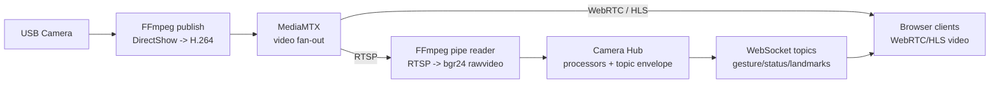
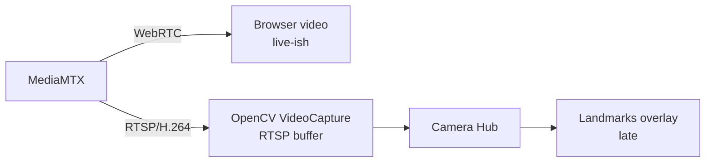

# MediaPipe Sword Sign Recognition

MediaPipeを使用した「刀印」および「チョキ」のジェスチャー判定モジュールです。
実験用スクリプトから検出ロジックを切り出し、外部アプリから `detect(frame) -> GestureState`
として利用できる形にしています。

更新履歴とセキュリティ対策の要点は `CHANGELOG.md` にまとめています。

## Architecture

このプロジェクトは Ports and Adapters に寄せた構成です。

- `mediapipe_sword_sign/`: gesture core。特徴量作成、モデル推論、`GestureState` protocolを担当
- `collect_data.py`: OpenCV + MediaPipeを使うデータ収集アダプタ
- `predict.py`: OpenCV表示つきのデバッグアプリ
- `train_model.py`: CSVから `gesture_model.pkl` を作る学習スクリプト
- `apps/serve_camera_hub.py`: カメラを1プロセスで所有し、topic envelopeでgesture stateを配信するhub

`serve_camera_hub.py` のtopic payloadは、ROS2へ移行しやすいように `Header` 相当の
`header` を持つenvelopeに包みます。ROS2には依存せず、gesture/status topicは
WebSocket上では通常のJSONです。JPEG画像topicは既定ではバイナリWebSocket frameで送り、
先頭に小さなtopic envelope JSON header、その後ろにJPEG bytesを連結します。
互換用に `--image-transport json` を指定すると従来型のJSON/base64でも配信できます。

```json
{
  "schema_version": 1,
  "topic": "/vision/sword_sign/state",
  "msg_type": "mediapipe_sword_sign/GestureState",
  "header": {
    "seq": 123,
    "stamp": 1710000000.0,
    "frame_id": "camera"
  },
  "payload": {
    "type": "gesture_state",
    "primary": "sword_sign"
  }
}
```

## Python API

```python
from mediapipe_sword_sign import SwordSignDetector

detector = SwordSignDetector()
state = detector.detect(frame_bgr)

print(state.sword_sign.active)
print(state.sword_sign.confidence)
print(state.to_json())
```

`GestureState.to_json()` は、Dify連携やWebSocket配信で使いやすいJSONを返します。

```json
{
  "type": "gesture_state",
  "timestamp": 1710000000.0,
  "source": "mediapipe_sword_sign",
  "hand_detected": true,
  "primary": "sword_sign",
  "gestures": {
    "sword_sign": { "active": true, "confidence": 0.92, "label": 0 },
    "victory": { "active": false, "confidence": 0.04, "label": 1 },
    "none": { "active": false, "confidence": 0.04, "label": 2 }
  }
}
```

## Scripts

1. データの収集
   `uv run collect_data.py`
2. モデルの学習
   `uv run train_model.py`
3. 推論の実行
   `uv run predict.py`
4. 単体テスト
   `uv run python -m unittest discover -s tests`

5. 設定GUI
   `uv run python apps/settings_gui.py`

6. Camera Hub
   `uv run python apps/serve_camera_hub.py`

7. Camera Hub Browser Monitor GUI
   `Start-Process .\apps\browser_camera_hub_viewer.html`

8. Camera Hub Python GUI
   `uv run python apps/camera_hub_gui.py`

## Security Notes

このリポジトリはローカル実験用ですが、公開・共有する場合は以下を守ってください。

- `.env`、ログ、CSV、`.pkl` は `.gitignore` 対象です。収集データや学習済みモデルは、公開リポジトリではなく信頼できる保管先で管理してください。
- `gesture_model.pkl` は joblib/pickle 形式です。信頼できない `.pkl` を読み込むと任意コード実行につながるため、既定ではプロジェクト配下のモデルだけを読み込みます。
- 外部から受け取ったモデルを使う場合は、SHA-256を確認して `--model-sha256` を指定してください。どうしても検証なしで読む場合だけ `--allow-untrusted-model` を明示します。

```powershell
Get-FileHash .\gesture_model.pkl -Algorithm SHA256
uv run python apps/settings_gui.py
uv run python apps/serve_websocket.py --model-path .\gesture_model.pkl --model-sha256 <SHA256>
```

WebSocketをlocalhost以外に公開する場合は、トークンなしでは起動を拒否します。トークンはコマンドライン引数ではなく環境変数で渡してください。

```powershell
$env:GESTURE_WS_TOKEN = "<random-token>"
uv run python apps/serve_websocket.py --host 0.0.0.0 --auth-token-env GESTURE_WS_TOKEN --allowed-origin http://localhost:3000
```

クライアントは `Authorization: Bearer <token>`、`X-Gesture-Token`、または検証済みローカル用途に限って `?token=<token>` で接続できます。URLクエリはログに残りやすいので、実運用ではヘッダーを使ってください。

## Without uv

uvがない環境でも、Pythonの仮想環境とpipで実行できます。
プロジェクトを作り直す必要はありません。

```powershell
python -m venv .venv
.\.venv\Scripts\Activate.ps1
python -m pip install --upgrade pip
python -m pip install -r requirements.txt
python apps/settings_gui.py
```

学習や推論も同じ環境で実行できます。

```powershell
python collect_data.py
python train_model.py
python predict.py
```

## Settings GUI

設定GUIは、モデルや判定しきい値を調整しながら現在フレーム判定と継続判定を確認するためのデバッグツールです。

起動すると、まず `MediaPipe Sword Sign Settings` という設定ウィンドウが表示されます。
`Start` を押すとカメラが開き、`Gesture Settings Preview` というOpenCVのプレビューウィンドウも表示されます。

```bash
uv run python apps/settings_gui.py
```

主な操作項目です。

- `Model`: 使用する `gesture_model.pkl` を指定します。通常は初期値のままで動きます。
- `Camera`: 使用するカメラ番号です。内蔵カメラは多くの場合 `0` です。
- `Threshold`: 1フレームごとの推論結果を active とみなす信頼度しきい値です。
- `Hold`: current frame の active 判定が何秒続いたら stable active とみなすかを指定します。
- `Grace`: 一瞬だけ手が外れた場合に、stable active を維持する猶予時間です。
- `Target`: 継続判定の対象gestureです。通常は `sword_sign` を選びます。
- `Mirror`: プレビューと判定入力を左右反転します。
- 判定時は元の特徴量と左右反転した特徴量を両方評価するため、右手/左手の差を吸収しやすくしています。
- `Landmarks`: プレビューにMediaPipeの手ランドマークを表示します。
- `Preview`: OpenCVプレビューウィンドウの表示/非表示を切り替えます。

状態表示の見方です。

- `Current`: `SwordSignDetector` による現在フレームの判定です。
- `Best Confidence`: 現在フレームで最も高かった推論信頼度です。
- `Target Confidence`: `Target` で選択しているgestureの現在フレーム信頼度です。
- `Hold State`: `Hold` と `Grace` を加味した継続判定の状態です。
- `Held For`: 対象gestureが継続している時間です。
- `Event`: stable active への切り替わり、または release を表示します。

停止するには設定ウィンドウの `Stop` を押します。プレビューウィンドウが有効な場合は、プレビュー側で `Esc` を押しても停止できます。

## Temporal Gesture State

`SwordSignDetector` は現在フレームの判定だけを担当します。
「一定時間継続したら有効」といった時間判定は `GestureHoldTracker` で後段処理します。

```python
from mediapipe_sword_sign import GestureHoldTracker, SwordSignDetector

detector = SwordSignDetector()
hold = GestureHoldTracker(target="sword_sign", hold_seconds=0.5, release_grace_seconds=0.1)

state = detector.detect(frame_bgr)
stable = hold.update(state)

print(state.sword_sign.active)  # current frame
print(stable.active)            # duration-based state
```

## Adapters

UDPで `GestureState` JSONを送る場合:

```bash
uv run python apps/publish_udp.py --host 127.0.0.1 --port 8765 --print-json
```

UDP送信先はデフォルトではlocalhost系だけを許可します。別マシンへ送る場合は、ジェスチャー状態をネットワークへ出すことを確認したうえで `--allow-remote-udp` を付けてください。

```bash
uv run python apps/publish_udp.py --host 192.0.2.10 --port 8765 --allow-remote-udp
```

UDP受信側がpayload内の `auth_token` を検証する場合は、起動前に `SWORD_VOICE_AGENT_AUTH_TOKEN` を設定してください。
設定されている場合、UDPで送る `gesture_state` / `gesture_status` / `gesture_heartbeat` payloadに `auth_token` を追加します。

```powershell
$env:SWORD_VOICE_AGENT_AUTH_TOKEN = "<random-token>"
uv run python apps/publish_udp.py --host 127.0.0.1 --port 8765
```

検証用に `--auth-token <token>` で直接指定することもできますが、コマンド履歴やプロセス一覧に残りやすいため、共有環境や常用起動では環境変数を使ってください。
`auth_token` は受信側が送信元を拒否するための共有秘密であり、暗号化ではありません。リモートUDPは信頼できるLAN、VPN、またはトンネル内で使ってください。

`apps/publish_udp.py` はデフォルトではGUIを出さず、UDP送信だけを行います。
カメラ入力、手検出、分類信頼度、UDP送信先を1行サマリで確認したい場合は `--debug` を指定します。
`--debug-every 30` は30フレームごと、`--debug-every 2s` は2秒ごとに表示します。

```bash
uv run python apps/publish_udp.py --host 127.0.0.1 --port 8765 --debug --debug-every 30
uv run python apps/publish_udp.py --host 127.0.0.1 --port 8765 --debug --debug-every 2s
```

OpenCVのプレビューウィンドウが必要な場合だけ `--preview` を指定します。
プレビューには `primary`、`sword confidence`、`hand detected`、UDP送信先をoverlay表示します。

```bash
uv run python apps/publish_udp.py --host 127.0.0.1 --port 8765 --preview --debug
```

MediaPipe経由でprotobufのdeprecation warningが通常ログに混ざる場合は、必要なときだけ
`--suppress-protobuf-warnings` を追加してください。デフォルトではwarningの扱いを変更しません。

統合側から起動前確認や機械読み取りを行うための汎用オプションもあります。

```bash
uv run python apps/publish_udp.py --version
uv run python apps/publish_udp.py --schema-json
uv run python apps/publish_udp.py --list-cameras
uv run python apps/publish_udp.py --health-json --host 127.0.0.1 --port 8765
uv run python apps/publish_udp.py --check-config --host 127.0.0.1 --port 8765
```

`--health-json` と `--check-config` のモデルエラーは、内部パスやハッシュ値を出さない短いエラーコードで返します。

実行中の状態をJSON行で監視したい場合は `--status-json` を指定します。
`--status-every` は `--debug-every` と同じく、裸の数値ならフレーム間隔、`s` 付きなら秒間隔です。

```bash
uv run python apps/publish_udp.py --host 127.0.0.1 --port 8765 --status-json --status-every 1s
```

UDP受信側へ送信中であることを示すheartbeatを出したい場合は、明示的に `--heartbeat-every` を指定します。
既存receiverとの互換性を保つため、heartbeatはデフォルトでは送信しません。
`sword-voice-agent` の通常UDP receiverは `gesture_state` を処理対象にするため、`gesture_heartbeat` は拒否または無視されることがあります。
heartbeatは、そのmessage typeを明示的に扱う受信側との疎通確認に限定してください。

```bash
uv run python apps/publish_udp.py --host 127.0.0.1 --port 8765 --heartbeat-every 5s
```

通常の `GestureState` payloadには、送信アダプタが汎用 `metadata` を追加します。
現在は `frame_id`、`hand_detected`、`primary_gesture`、`fps` を含みます。
起動時は選択カメラとUDP送信先をstderrに短く表示し、終了時は `stopped` をstderrに出します。
ログ、`--print-json`、`--status-json` にはtokenやAPI keyなどの秘密情報を出さない方針です。

WebSocketで接続中のクライアントへbroadcastする場合:

```bash
uv run python apps/serve_websocket.py --host 127.0.0.1 --port 8765
```

Camera Hubとして、同じカメラを1プロセスで開き、topic envelopeつきのWebSocket payloadを配信する場合:

```bash
uv run python apps/serve_camera_hub.py --host 127.0.0.1 --port 8765
```

Camera Hub内部では、カメラ取り込み、gesture推論、status/image配信を分けて動かします。
MediaPipe推論が重い環境でも、画像topicは最新フレームを別周期で配信できます。
ブラウザGUIを実装・統合する場合は、GUIの役割分担、topic形式、5-6クライアント時の目安を
[Browser GUI Integration Guide](docs/browser_gui_integration.md) にまとめています。
複数カメラや5-6以上のブラウザ配信を見据える場合は、映像配信をMediaMTXへ逃がす構成を
[MediaMTX Integration Guide](docs/mediamtx_integration.md) にまとめています。

主なtopicです。

- `/vision/sword_sign/state`: `GestureState` と `GestureHoldTracker` のstable判定を配信します。
- `/camera/status`: カメラFPS、選択camera index、processor状態を配信します。
- `/camera/color/image_raw/compressed`: `--publish-jpeg-every` を指定した場合だけJPEG frameを配信します。

### Camera Hub GUIの位置づけ

通常のGUIは `apps/browser_camera_hub_viewer.html` です。
このBrowser Monitorは **MediaMTXの映像** と **Camera HubのWebSocket topic** を同時に見ます。
GUIはカメラを直接開かず、Camera Hubも通常はUSBカメラ番号 `0` を直接読みません。
MediaMTX構成では以下の流れに揃えてください。

```text
Camera / FFmpeg publish
  -> MediaMTX / cam0
      -> Browser Monitor video: http://127.0.0.1:8889/cam0
      -> Camera Hub input: rtsp://127.0.0.1:8554/cam0
Camera Hub
  -> Browser Monitor state: ws://127.0.0.1:8765
```

統合起動する場合は、このリポジトリでは次を使います。

```powershell
scripts\start_camera_hub_stack.bat --camera-name "HD Pro Webcam C920"
```

このスクリプトはMediaMTX、FFmpeg publish、Camera Hub、Browser Monitorをまとめて起動します。
もし下流アプリ側に `start-home-control-stack` のような起動スクリプトがある場合も、同じ役割分担にしてください。
Browser Monitorだけを `http://127.0.0.1:8889/cam0` へ向けても、MediaMTXとFFmpeg publishが起動していなければ映像は出ません。

`apps/camera_hub_gui.py` はPythonデバッグGUIです。
Camera HubのWebSocket topicを購読しますが、`--publish-jpeg-every 0` の通常MediaMTX構成では映像プレビューは出ません。
Python GUIにも映像を出したい検証時だけ、hub側でJPEG topicを有効にします。

```bash
uv run python apps/serve_camera_hub.py --host 127.0.0.1 --port 8765 --publish-jpeg-every 0.05
uv run python apps/camera_hub_gui.py
```

JSON/base64でJPEG topicを確認したい場合だけ、hub側に `--image-transport json` を付けます。
gesture推論のCPU負荷を抑えたい場合は `--gesture-every 0.1` のように推論周期を指定できます。
さらに軽くしたい場合は `--gesture-model-complexity 0` でMediaPipe Handsを軽量モデルにできます。

Windowsでカメラ取り込み自体が10fps前後で頭打ちになる場合は、DirectShowとMJPGを明示すると改善することがあります。

```bash
uv run python apps/serve_camera_hub.py --host 127.0.0.1 --port 8765 --camera-backend dshow --camera-width 640 --camera-height 480 --camera-fps 30 --camera-fourcc MJPG --publish-jpeg-every 0.05 --gesture-every 0.1 --gesture-model-complexity 0
```

MediaMTXなど外部media serverからRTSP streamを読んでgesture/statusだけ配信する場合は、
RTSP/H.264の内部バッファを避けるため `ffmpeg-pipe` backendを優先します。

```bash
uv run python apps/serve_camera_hub.py --host 127.0.0.1 --port 8765 --interval 0 --camera-source rtsp://127.0.0.1:8554/cam0 --camera-backend ffmpeg-pipe --camera-width 640 --camera-height 480 --camera-fps 30 --frame-id cam0 --publish-jpeg-every 0 --gesture-every 0.1 --gesture-model-complexity 0
```

## External Tools

このプロジェクトのgesture認識そのものはPython依存だけで動きます。
ただし、複数カメラや複数ブラウザクライアントへ映像を配信する構成では、Pythonで映像配信まで抱えず、
外部media serverとFFmpegを使います。

必要な外部ツールです。

| Tool | 必要な場面 | 確認済み/推奨バージョン | 用途 |
| --- | --- | --- | --- |
| MediaMTX | 複数カメラ、複数ブラウザ配信 | `v1.18.1` Windows amd64 | RTSP/WebRTC/HLS media server |
| FFmpeg / ffprobe | Windows USBカメラをMediaMTXへpublish、RTSP確認 | `2026-04-30-git-cc3ca17127` gyan.dev essentials buildで確認 | DirectShow capture、H.264 encode、疎通確認 |

MediaMTXは、映像を多数クライアントへ配るために使います。
PythonのCamera HubはMediaMTXのRTSP streamを読み、gesture/statusだけをWebSocketで配信します。

複数ブラウザで見る場合も、MediaPipe推論はCamera Hub内で1回だけ行います。
各ブラウザはMediaMTXから映像を受け取り、Camera Hubから軽量なJSON topicだけを受け取ります。

```text
Camera -> FFmpeg -> MediaMTX -> WebRTC/HLS -> Browser clients
                         |
                         +-> RTSP -> Camera Hub -> WebSocket topics -> Browser clients
```

`ffmpeg-pipe` backendはMediaMTXを置き換えるものではありません。
MediaMTXは引き続き映像配信を担当し、`ffmpeg-pipe` はCamera HubがMediaMTXのRTSPを読む方法だけを
OpenCV `VideoCapture` からFFmpeg raw pipeへ切り替えます。これにより、OpenCV RTSP readerの内部バッファで
landmarksが映像より遅れる問題を避けやすくなります。

FFmpegは、WindowsのUSBカメラをDirectShowで開いてMediaMTXへpublishするために使います。
`ffprobe` は `cam0` streamが実際に読めるか確認するために使います。

## Low-Latency Hub Policy

このモジュールが提唱する低遅延構成は、**映像配信と推論を分けつつ、Camera Hubが常に最新寄りのframeを読む** ことです。
ここでいう低遅延は「ゼロ遅延」ではなく、gesture/landmarksがブラウザ映像に目視で遅れて見えないことを目標にします。

推奨構成です。



この構成で守る原則です。

- **MediaMTXは映像配信の担当**です。複数ブラウザへ映像を配る仕事をPythonに持たせません。
- **Camera Hubは推論用frameの担当**です。MediaMTXのRTSPを読み、gestureやroom lightなどのprocessorを1回だけ動かします。
- **Camera HubのRTSP readerは `ffmpeg-pipe` を既定にします。** OpenCV `VideoCapture(rtsp://...)` は内部バッファで古いframeを返すことがあるため、低遅延overlay用途では比較用・fallback扱いにします。
- **GUIはカメラを直接開きません。** GUIはMediaMTX映像とCamera Hub topicsを購読するだけにします。
- **本番ではPython JPEG配信をOFFにします。** `--publish-jpeg-every 0` を基本にし、Python GUIやframe確認が必要なデバッグ時だけONにします。
- **capture loopに余分なsleepを入れません。** `--capture-interval 0` を基本にし、FFmpeg pipeから届くframeをすぐ消費します。
- **判定の意図的な遅延と入力遅延を分けます。** `--release-grace-seconds` やhold判定は安定化のための遅延です。入力frameが古い場合の遅延とは別に扱います。

避ける構成です。



この構成では、ブラウザ映像は遅れていないのに、Camera HubがOpenCV RTSP readerから古いframeを受け取り、
landmarksだけが1秒前後遅れて見えることがあります。`Topic Age` はCamera Hubがframeを読んだ時刻から計算されるため、
reader内部ですでに古いframeを掴んでいる場合は小さく見えることがあります。

標準の起動は以下です。統合起動では `--hub-camera-backend ffmpeg-pipe` が既定です。

```powershell
scripts\start_camera_hub_stack.bat --camera-name "HD Pro Webcam C920" --force-stop-existing
```

低遅延確認のためにPython GUIも同時に見る場合:

```powershell
scripts\start_camera_hub_stack.bat `
  --camera-name "HD Pro Webcam C920" `
  --force-stop-existing `
  --publish-jpeg-every 0.05 `
  --python-gui
```

この確認で、Python GUIの映像とlandmarksが一緒に遅れる場合は、Camera Hub入力frameが遅れています。
ブラウザ映像だけが速く、landmarksだけが遅れる場合も、まずCamera HubのRTSP readerを疑います。
`ffmpeg-pipe` でも遅れる場合は、FFmpeg publish側のエンコード設定、MediaMTX設定、またはCPU負荷を確認します。

手動でCamera Hubだけを起動する場合の低遅延基本形です。

```powershell
uv run python apps/serve_camera_hub.py `
  --host 127.0.0.1 `
  --port 8765 `
  --interval 0 `
  --camera-source rtsp://127.0.0.1:8554/cam0 `
  --camera-backend ffmpeg-pipe `
  --camera-width 640 `
  --camera-height 480 `
  --camera-fps 30 `
  --frame-id cam0 `
  --publish-jpeg-every 0 `
  --gesture-every 0.05 `
  --gesture-model-complexity 0 `
  --release-grace-seconds 0.03 `
  --publish-landmarks
```

比較やfallbackのために旧OpenCV RTSP readerへ戻す場合だけ、以下を使います。

```powershell
scripts\start_camera_hub_stack.bat `
  --camera-name "HD Pro Webcam C920" `
  --force-stop-existing `
  --hub-camera-backend ffmpeg
```

低遅延トラブルシュートの見方です。

| 症状 | 可能性が高い箇所 | 確認/対策 |
| --- | --- | --- |
| `http://127.0.0.1:8889/cam0` は速いがlandmarksだけ遅い | Camera HubのRTSP reader | `--hub-camera-backend ffmpeg-pipe` を使う |
| Python GUIでも映像とlandmarksが一緒に遅い | Camera Hub入力frame | OpenCV backendを避ける、CPU負荷を見る |
| `Topic Age` が大きい | Camera Hub内の処理詰まり | `--gesture-every`、model_complexity、CPU使用率を見る |
| `Stable` だけ解除が遅い | hold/release smoothing | `--release-grace-seconds` を小さくする |
| ブラウザだけ重い | クライアント側描画負荷 | landmarks/overlay表示を減らす、接続数を確認する |

Camera Hubは低遅延の切り分け用に、`/camera/status` へ診断値もpublishします。ブラウザGUIとPython GUIの両方で確認できます。

- `capture.frame_age_ms`: Camera Hubが持っている最新frameが何ms前に読まれたものか
- `capture.read_latency_ms`: 直近のframe readにかかった時間
- `capture.read_failures`: 起動後のread失敗回数
- `capture.read_fps`: Camera Hubが実際に読めているframe rate
- `processors.sword_sign.inference_ms`: sword_sign processorの直近推論時間
- `processors.sword_sign.publish_age_ms`: gesture topic publish時点での入力frame年齢

複数カメラでも考え方は同じです。各camera pathごとにMediaMTXへpublishし、推論が必要なcameraだけCamera Hub workerを立てます。
映像配信数はMediaMTX側で吸収し、Python側は必要なprocessorだけを実行します。

### MediaMTXの導入

1. MediaMTXのWindows amd64リリースzipを入手します。
2. 例として以下へ展開します。

```powershell
C:\Tools\mediamtx_v1.18.1_windows_amd64\mediamtx.exe
```

3. PATHへ追加します。

```powershell
$env:Path += ";C:\Tools\mediamtx_v1.18.1_windows_amd64"
```

恒久的にPATHへ入れる場合は、Windowsの環境変数設定で
`C:\Tools\mediamtx_v1.18.1_windows_amd64` を追加してください。

4. バージョンを確認します。

```powershell
mediamtx --version
```

`MediaMTX v1.18.1` のように表示されればOKです。

### FFmpegの導入

1. Windows向けFFmpeg buildを入手します。検証ではgyan.dev essentials buildを使っています。
2. 例として以下へ展開します。

```powershell
C:\Tools\ffmpeg\bin\ffmpeg.exe
C:\Tools\ffmpeg\bin\ffprobe.exe
```

3. PATHへ追加します。

```powershell
$env:Path += ";C:\Tools\ffmpeg\bin"
```

4. バージョンを確認します。

```powershell
ffmpeg -version
ffprobe -version
```

5. DirectShowカメラ一覧が出ることを確認します。

```powershell
ffmpeg -list_devices true -f dshow -i dummy
```

出力に `"HD Pro Webcam C920" (video)` のようなvideo deviceが出ればOKです。

## MediaMTX Setup

複数カメラ、または複数ブラウザクライアントへ映像を配信する場合は、PythonからJPEG frameを多数配信するより、
MediaMTXに映像配信を任せます。この構成では、MediaMTXが映像をWebRTC/HLS/RTSPで配信し、
PythonのCamera HubはRTSP streamを読んでgesture/status topicだけをWebSocket配信します。

### 1. MediaMTXを導入する

MediaMTXのリリースzipを展開し、例として以下に置きます。

```powershell
C:\Tools\mediamtx_v1.18.1_windows_amd64\mediamtx.exe
```

必要ならPATHへ追加します。

```powershell
$env:Path += ";C:\Tools\mediamtx_v1.18.1_windows_amd64"
mediamtx --version
```

`mediamtx --version` で `v1.18.1` のように表示されればOKです。

FFmpegもPATHから見えることを確認します。

```powershell
ffmpeg -version
ffprobe -version
```

### 2. MediaMTXを起動する

このリポジトリの明示的なpublisher用設定で起動します。

```powershell
mediamtx configs\mediamtx\mediamtx.publisher.example.yml
```

MediaMTXを設定なしで起動すると、環境によっては任意pathへのpublishが許可されず、
FFmpeg側が `Server returned 400 Bad Request` で失敗することがあります。
まずは `configs\mediamtx\mediamtx.publisher.example.yml` を使って、`cam0` から `cam4` までのpathを明示します。

この時点ではMediaMTXが待ち受けているだけで、`/cam0` の映像streamはまだ存在しません。
別terminalでカメラ映像をMediaMTXへpublishする必要があります。

待受確認:

```powershell
Get-NetTCPConnection -LocalPort 8554,8888,8889 -State Listen
```

### 3. Windowsのカメラ名を確認する

```powershell
ffmpeg -list_devices true -f dshow -i dummy
```

出力例:

```text
"HD Pro Webcam C920" (video)
"OBS Virtual Camera" (none)
```

FFmpegの `video="..."` には、この表示名をそのまま指定します。

### 4. cam0へ一時publishして確認する

MediaMTXを起動したまま、別terminalでカメラを `/cam0` にpublishします。

```powershell
ffmpeg -f dshow `
  -video_size 640x480 `
  -framerate 30 `
  -i video="HD Pro Webcam C920" `
  -c:v libx264 `
  -pix_fmt yuv420p `
  -preset ultrafast `
  -tune zerolatency `
  -b:v 800k `
  -f rtsp rtsp://127.0.0.1:8554/cam0
```

RTSP stream確認:

```powershell
ffprobe -rtsp_transport tcp -v error -show_entries stream=codec_type,width,height,avg_frame_rate -of default=noprint_wrappers=1 rtsp://127.0.0.1:8554/cam0
```

ブラウザ確認:

```text
http://127.0.0.1:8889/cam0
```

`serve_camera_hub.py --camera-source rtsp://127.0.0.1:8554/cam0` は、
このRTSP確認が成功してから起動してください。`mediamtx` だけ起動しても `cam0` は読めません。

### 5. Python Camera HubでRTSPを読む

MediaMTXの映像をPython側で読み、gesture/statusだけ配信します。

```powershell
uv run python apps/serve_camera_hub.py `
  --host 127.0.0.1 `
  --port 8765 `
  --interval 0 `
  --camera-source rtsp://127.0.0.1:8554/cam0 `
  --camera-backend ffmpeg-pipe `
  --camera-width 640 `
  --camera-height 480 `
  --camera-fps 30 `
  --frame-id cam0 `
  --publish-jpeg-every 0 `
  --gesture-every 0.05 `
  --gesture-model-complexity 0 `
  --release-grace-seconds 0.03 `
  --publish-landmarks
```

`--camera-backend ffmpeg-pipe` はOpenCVのRTSP readerではなく、FFmpeg subprocessから
raw BGR frameをpipeで受ける低遅延backendです。
`--publish-jpeg-every 0` にすることで、Pythonからの画像配信を止めます。
ブラウザ映像はMediaMTXのWebRTC/HLSを使い、Python WebSocketはgesture/status用にします。

ジェスチャーをやめた時のGUI反応が遅い場合は、以下を確認します。

- GUIの `Topic Age` が大きい場合は、RTSP/OpenCV/推論側で古いframeを処理しています。
- `Stable` は `--release-grace-seconds` の分だけ意図的にreleaseを遅らせます。反応重視なら `0` から `0.05` 程度にします。
- `Target` は現在フレーム判定、`Stable` はhold/grace後の判定です。解除の速さを見るときはまず `Target` も確認してください。
- RTSP入力ではまず `--camera-backend ffmpeg-pipe` を使います。OpenCV backendへ戻す場合だけ `--camera-backend ffmpeg` と低遅延FFmpeg capture optionsを使います。

低遅延寄りの起動例:

```powershell
uv run python apps/serve_camera_hub.py `
  --host 127.0.0.1 `
  --port 8765 `
  --interval 0 `
  --camera-source rtsp://127.0.0.1:8554/cam0 `
  --camera-backend ffmpeg-pipe `
  --camera-width 640 `
  --camera-height 480 `
  --camera-fps 30 `
  --frame-id cam0 `
  --publish-jpeg-every 0 `
  --gesture-every 0.05 `
  --gesture-model-complexity 0 `
  --release-grace-seconds 0.03 `
  --publish-landmarks
```

`ffmpeg-pipe` では `--opencv-ffmpeg-capture-options` は使いません。
OpenCV backendへ戻した場合にOpenCV/FFmpeg buildがcapture optionを拒否するなら、
`--opencv-ffmpeg-capture-options none` で無効化してから切り分けます。

### 6. GUIと映像確認を起動する

MediaMTX構成では、映像確認とgesture/status確認を分けます。

MediaMTXで映像を見る場合は、ブラウザで以下を開きます。

```text
http://127.0.0.1:8889/cam0
```

このURLはMediaMTXのWebRTC viewerです。`ffmpeg` publishが動いていて、`ffprobe` が成功していれば映像が表示されます。
MediaMTX標準viewerは映像だけを表示します。ミラー反転、gesture/status、hand landmarks overlayを同時に見たい場合は、
このリポジトリのブラウザdebug viewerを開きます。

```powershell
Start-Process .\apps\browser_camera_hub_viewer.html
```

browser debug viewerの既定値です。

- MediaMTX URL: `http://127.0.0.1:8889/cam0?controls=false&muted=true&autoplay=true`
- Camera Hub WebSocket: `ws://127.0.0.1:8765`
- `Mirror`: 映像を鏡反転し、overlay座標もそれに合わせます。
- `Landmarks`: Camera Hubが `--publish-landmarks` で配信したMediaPipe landmarksを重ねます。
- `Topic Age`: gesture topicのheader timestampから見た遅延目安です。
- `Gesture Scores`: 各gestureのconfidenceを以前のGUIに近い形で一覧表示します。
- `Last Envelope JSON`: 最後に受け取ったtopic envelopeを確認できます。

複数クライアントで見る場合も、各ブラウザは同じURLを開きます。

```text
映像: http://127.0.0.1:8889/cam0?controls=false&muted=true&autoplay=true
状態: ws://127.0.0.1:8765
```

5-6クライアント程度なら、映像はMediaMTXが配信し、Camera Hubはgesture/status/landmarksのJSONだけを配るため、
Python側でクライアント数ぶんMediaPipe推論が増えるわけではありません。
Camera HubのWebSocket接続数上限は既定で `8` です。それ以上を想定する場合は、起動時に
`--max-clients` を増やしてください。

#### Browser overlay latency probe

最終ブラウザGUI上で、映像に対してlandmarks overlayがどの程度遅れて表示されるかを
カメラなしで測るためのprobeです。`tests\pict_for_debug\hand_in.png` と
`tests\pict_for_debug\hand_out.png` を交互に表示する小さなHTTP serverと、
同じタイミングでCamera Hub互換のgesture topicを送るWebSocket serverを起動します。
カメラやMediaMTXは使わないため、他の作業者がカメラ映像を使っていても切り分けできます。
この2枚のPNGは個人のカメラ画像になりやすいため `.gitignore` 対象です。必要な環境でローカルに配置してください。

```powershell
uv run python apps/measure_browser_overlay_latency.py
```

起動すると、以下のような `open viewer:` URLが表示されます。そのURLをブラウザで開くと、
通常の `apps\browser_camera_hub_viewer.html` がprobe用のmedia/WebSocketへ接続されます。

```text
latency probe media: http://127.0.0.1:8771/media.html
latency probe websocket: ws://127.0.0.1:8772
open viewer: file:///.../apps/browser_camera_hub_viewer.html?mediaUrl=...&wsUrl=...&measure=1
```

ブラウザ右側の `Latency Probe` を確認します。

- `Last Delta`: 画像がブラウザに表示された時刻から、対応するlandmarks overlayがGUIへ反映された時刻までの差です。
- 正の値はoverlayが映像より遅いことを示します。
- `Average` / `P95` / `Min / Max`: 直近サンプルの集計です。

計測器自体の確認には、意図的な遅延を入れます。たとえば以下では `Last Delta` が約1000ms増えれば、
probeとGUI側の計測経路は期待どおりです。

```powershell
uv run python apps/measure_browser_overlay_latency.py --landmark-delay-ms 1000
```

既定ではHTTP `8771`、WebSocket `8772` を使います。どちらかが使用中の場合は空きportへ自動で切り替え、
terminalに `warning: 127.0.0.1:8771 is in use; using ... instead` のように表示します。
固定portで失敗させたい場合は `--no-auto-port` を指定します。
計測probeは既定でlocalhost専用です。`--host 0.0.0.0` などでLANへ出す場合は、未認証の検証用HTTP/WebSocketを公開することを理解した上で `--allow-remote-probe` を明示してください。

HLSで確認したい場合は以下を開きます。WebRTCより遅延は増えますが、確認が簡単な場合があります。

```text
http://127.0.0.1:8888/cam0
```

Python GUIでgesture/statusを確認する場合:

```powershell
uv run python apps/camera_hub_gui.py
```

GUIの接続先は既定で `ws://127.0.0.1:8765` です。
`--publish-jpeg-every 0` でCamera Hubを起動している場合、Python GUIには映像は出ません。
映像はMediaMTXのブラウザURLで確認してください。

Python GUIにも映像を出したいデバッグ時だけ、Camera Hubを以下のように起動します。
ただし複数カメラ/複数クライアント運用では、映像配信はMediaMTXに任せる方針を推奨します。

```powershell
uv run python apps/serve_camera_hub.py `
  --host 127.0.0.1 `
  --port 8765 `
  --interval 0 `
  --camera-source rtsp://127.0.0.1:8554/cam0 `
  --camera-backend ffmpeg-pipe `
  --camera-width 640 `
  --camera-height 480 `
  --camera-fps 30 `
  --frame-id cam0 `
  --publish-jpeg-every 0.05 `
  --gesture-every 0.05 `
  --gesture-model-complexity 0 `
  --release-grace-seconds 0.03 `
  --publish-landmarks
```

### 7. 統合起動バッチ

複数terminalを開かずに、MediaMTX、FFmpeg publish、Python Camera Hub、ブラウザdebug viewerを
1つのterminalからまとめて起動できます。
このリポジトリでの標準GUI起動はこのバッチです。

```powershell
scripts\start_camera_hub_stack.bat --camera-name "HD Pro Webcam C920"
```

起動時にterminalへ以下の対応関係を表示します。

- `Browser Monitor video`: Browser Monitorが見るMediaMTX WebRTC URL
- `Camera Hub input`: Camera Hubが推論に使うRTSP URL
- `Camera Hub topics`: gesture/status/landmarksを購読するWebSocket URL

ブラウザdebug viewerはこれらをURL queryで受け取って開くため、portやcamera pathを変えた場合も既定値に引きずられません。
Home Control側の起動スクリプトを別に作る場合も、まずMediaMTXとFFmpeg publishを起動し、
Camera Hubは `--camera-source rtsp://127.0.0.1:8554/cam0` を読む構成にしてください。
MediaMTXがいない状態でBrowser Monitorだけ開いても、映像paneは表示できません。

前回のMediaMTX / Camera Hub、またはstack用portの利用が残っている可能性がある場合は、起動前チェックで検出します。
検出時は通常は起動を止めます。自動で残存プロセスを止めてから起動する場合:

```powershell
scripts\start_camera_hub_stack.bat --camera-name "HD Pro Webcam C920" --force-stop-existing
```

5-6クライアントを想定する通常の確認では既定値のままで足ります。
より多いブラウザから同時にgesture/statusを購読する場合は、Camera HubのWebSocket上限を増やします。

```powershell
scripts\start_camera_hub_stack.bat `
  --camera-name "HD Pro Webcam C920" `
  --force-stop-existing `
  --max-clients 12
```

起動後、同じterminalに各プロセスのログが `[mediamtx]`、`[ffmpeg-cam0]`、`[camera-hub]` のように
prefix付きで流れます。ログファイルは以下に保存されます。

```text
.runtime\camera-hub-stack\logs
```

終了するときは、起動したterminalで `Ctrl+C` を押します。
supervisorが以下の順で安定終了を試みます。

1. FFmpegへ `q` を送ってRTSP publishを終了
2. MediaMTX / Camera Hubへ中断シグナルを送信
3. 一定時間待って残ったプロセスだけprocess treeごと終了

主なオプションです。

```powershell
scripts\start_camera_hub_stack.bat `
  --camera-name "HD Pro Webcam C920" `
  --width 640 `
  --height 480 `
  --fps 30 `
  --bitrate 800k `
  --gop 30 `
  --capture-interval 0 `
  --hub-port 8765 `
  --max-clients 8
```

- `--no-browser`: ブラウザdebug viewerを自動で開きません。
- `--python-gui`: Python GUIも同じsupervisor配下で起動します。
- `--publish-jpeg-every 0.05`: Python GUIにも映像を出したいデバッグ時だけ指定します。
- `--capture-interval 0`: Camera Hub側のcapture loopで追加sleepしません。`ffmpeg-pipe` ではFFmpeg stdoutをすぐ読み、OpenCV backendではreaderが遅れ続けるのを避けます。
- `--hub-camera-backend ffmpeg-pipe`: 既定値です。Camera HubのRTSP readerでOpenCV内部バッファを避けます。
- `--hub-camera-backend ffmpeg`: 従来のOpenCV FFmpeg backendへ戻す場合に指定します。
- `--gop 30`: H.264のキーフレーム間隔です。30fpsでは約1秒ごとにキーフレームを入れます。
- `--camera-read-timeout-ms 3000`: OpenCV backendでRTSP/H.264の次フレームを待つ時間です。`ffmpeg-pipe` ではFFmpeg subprocess側が読み取りを担当します。
- `--skip-rtsp-wait`: FFmpeg publish後の `ffprobe` 疎通待ちを省略します。
- `--hub-wait-seconds 20`: Camera Hub WebSocketの待受開始を待つ秒数です。
- `--max-clients 8`: Camera Hub WebSocketの最大接続数です。映像配信数ではなくgesture/status購読数です。
- `--force-stop-existing`: 前回残ったMediaMTX / Camera Hubや使用中portを止めてから起動します。無関係なFFmpegプロセスを名前だけで止めないよう、genericな `ffmpeg` 検索はしません。
- `--mediamtx-path` / `--ffmpeg-path` / `--ffprobe-path`: PATHが通っていない場合にexeを明示します。

`--max-clients` はCamera HubのJSON topic購読上限です。
映像の配信数はMediaMTX側の仕事なので、ブラウザが増えてもPythonが映像を再エンコードして配る構成ではありません。
ただし、各クライアントがlandmarks JSONを受け取るためWebSocket送信数は増えます。
まずは `8` から始め、12台以上を常用するなら実機でCPU、ネットワーク、ブラウザ側CPUを確認してください。

### 7'. 手動起動コマンドまとめ

MediaMTX構成の手動起動手順です。切り分け時は各コマンドを別terminalで起動します。

1. 作業ディレクトリへ移動:

```powershell
cd C:\Users\kawai\works\media-pipe-sword-sign\mediapipe-sword-sign
```

2. MediaMTXを起動:

```powershell
mediamtx configs\mediamtx\mediamtx.publisher.example.yml
```

3. カメラをMediaMTXへpublish:

```powershell
ffmpeg -f dshow `
  -video_size 640x480 `
  -framerate 30 `
  -i video="HD Pro Webcam C920" `
  -c:v libx264 `
  -pix_fmt yuv420p `
  -preset ultrafast `
  -tune zerolatency `
  -b:v 800k `
  -f rtsp rtsp://127.0.0.1:8554/cam0
```

4. RTSPを確認:

```powershell
ffprobe -rtsp_transport tcp -v error -show_entries stream=codec_type,width,height,avg_frame_rate -of default=noprint_wrappers=1 rtsp://127.0.0.1:8554/cam0
```

5. MediaMTXで映像確認:

```text
http://127.0.0.1:8889/cam0
```

6. Python Camera Hubを起動:

```powershell
uv run python apps/serve_camera_hub.py `
  --host 127.0.0.1 `
  --port 8765 `
  --interval 0 `
  --camera-source rtsp://127.0.0.1:8554/cam0 `
  --camera-backend ffmpeg-pipe `
  --camera-width 640 `
  --camera-height 480 `
  --camera-fps 30 `
  --frame-id cam0 `
  --publish-jpeg-every 0 `
  --gesture-every 0.05 `
  --gesture-model-complexity 0 `
  --release-grace-seconds 0.03 `
  --publish-landmarks
```

7. Python GUIを起動:

```powershell
uv run python apps/camera_hub_gui.py
```

7'. ブラウザdebug viewerを起動:

```powershell
Start-Process .\apps\browser_camera_hub_viewer.html
```

### 8. 設定ファイルで自動publishする

毎回FFmpegコマンドを手で起動する代わりに、MediaMTXの `runOnInit` でカメラをpublishできます。
サンプル設定は以下です。

```powershell
configs\mediamtx\mediamtx.windows.example.yml
```

使い方:

```powershell
Copy-Item configs\mediamtx\mediamtx.windows.example.yml mediamtx.yml
notepad mediamtx.yml
```

`CAMERA_0_NAME` を `HD Pro Webcam C920` など実際のカメラ名に置き換えます。
既に `mediamtx` を起動している場合はいったん止め、設定ファイルを指定して起動します。

```powershell
mediamtx mediamtx.yml
```

一時publishの検証だけなら `mediamtx.publisher.example.yml`、MediaMTX起動時にカメラも自動起動したい場合は
`mediamtx.windows.example.yml` を使います。

`cam0` が読めるかを確認します。

```powershell
ffprobe -rtsp_transport tcp -v error -show_entries stream=codec_type,width,height,avg_frame_rate -of default=noprint_wrappers=1 rtsp://127.0.0.1:8554/cam0
```

### 9. よくあるエラー

`serve_camera_hub.py` が以下で止まる場合:

```text
error: camera not available: rtsp://127.0.0.1:8554/cam0
```

原因は多くの場合、MediaMTXは起動しているが `/cam0` streamが存在しないことです。

確認してください。

- `mediamtx` が起動している
- 8554/8888/8889がListenしている
- FFmpegが `rtsp://127.0.0.1:8554/cam0` へpublish中である
- または `mediamtx.yml` の `runOnInit` が正しいカメラ名で動いている
- `ffprobe rtsp://127.0.0.1:8554/cam0` が成功する

詳しい構成と複数カメラ方針は [MediaMTX Integration Guide](docs/mediamtx_integration.md) を参照してください。

Difyや音声入力とのつなぎ方は、実運用コードではなく参考サンプルとして
`examples/sword_push_to_talk_sample.py` に置いています。
